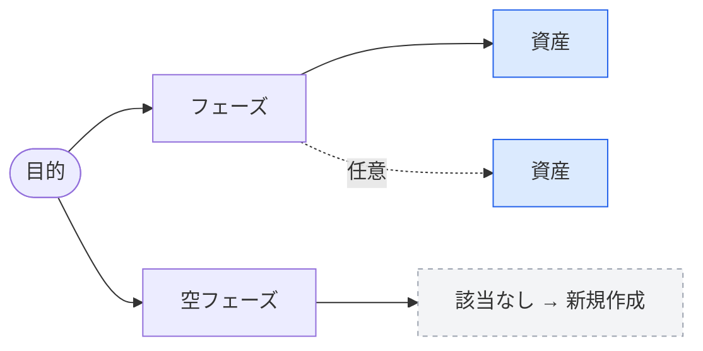

# 確定テンプレート（一貫性のための単一の正）

各実行で**この通り**に質問・出力する。言い回しや列を勝手に変えない。
ここを唯一の正とし、SKILL.md 側で表現を再発明しないこと。

## 目次

- [質問テンプレ](#質問テンプレ)（[2] 環境 / [3] フェーズ）
- [提案出力スケルトン](#提案出力スケルトン)（[7]）
- [再現プロンプトのスケルトン](#再現プロンプトのスケルトン)（[8-2]）

---

## 質問テンプレ

ヒアリング（[1]〜[3]）は `AskUserQuestion` を使う。header・選択肢は下記で固定。
各選択肢には一言の補足を付ける（用語を知らない利用者向け）。

### [2] 環境（単一選択）

- question: 「主に使う動作環境はどれですか？」
- header: 「環境」
- options（この 4 つで固定。逃げ道を必ず含める）:
  1. `Claude Code` — skill/agent/MCP がセッション提示済み
  2. `GitHub Copilot Chat` — VS Code 等。instructions ファイル中心
  3. `その他 / 社内独自基盤` — Gemini CLI / Cursor / Devin / 社内ツール等
  4. `わからない / 決めていない` — 作業内容から候補環境を逆提案する

### [3] フェーズ（複数選択可）

- question: 「今回の作業はどのフェーズですか？（迷う場合は複数選択可）」
- header: 「フェーズ」
- options（6 区分。粒度は粗く保つ）:
  1. `調査・リサーチ` — 一次情報・データ収集、ソース探索
  2. `企画` — 要件整理、構成案・設計方針づくり
  3. `資料作成` — ドキュメント・スライド・表計算などの成果物作成
  4. `開発` — コード作成、テスト、デプロイ
  5. `運用・保守` — 監視、インシデント対応、問い合わせ・保守
  6. `振り返り・分析` — 分析、レポーティング、改善

> 目的の具体化（[1]）も `AskUserQuestion` で 1 回だけ促してよい。
> 1〜2 回で絞れなければ、その粒度のまま進める（探りモード）。

---

## 提案出力スケルトン（[7]）

**必ず「表 → 図 → 結論」の順**で、下記の形をそのまま埋める。

### 1. 表（列は固定・この順）

| 区分 | 資産 | 用途（1行） | 効くフェーズ | 出所 | 優先度 | 備考 |
|------|------|-------------|--------------|------|--------|------|
| 既に利用可能 | （資産名） | （用途） | （フェーズ） | 組み込み/導入済み | — | セットアップ不要 |
| 社内 | （資産名） | （用途） | （フェーズ） | leomaro7/skills 等 | 中核/任意 | （絞り込み理由） |
| 外部 | （資産名） | （用途） | （フェーズ） | （許可リストの出所） | 中核/任意 | （信頼性メモ） |

- **区分**：現環境での導入状態で決める。`既に利用可能`（導入済み・対象外）/
  `社内`（レジストリにあるが未導入＝要採用）/ `外部`（許可リスト掲載）。
- **優先度**：`中核` / `任意`。既に利用可能なものは `—`。
- 並び順：`既に利用可能` → `社内` → `外部`。

### 2. 図（Mermaid・補助）

区分を色で分け、空フェーズは破線で「新規作成（[6]）」を示す。
`classDef` 4 種は固定（端末では描画されないため、表を正・図は補助）。



（`ready`=既に利用可能 / `intra`=社内 / `ext`=外部 / `none`=該当なし）

### 3. 結論

- 中核が「既に利用可能」だけで満たせるなら **新規採用ゼロ**でよい
  （「追加の資産は不要」と結論。当てはまらないものを押し込まない）。
- 最後に「表のどれを採用するか」を利用者に選んでもらう。

---

## 再現プロンプトのスケルトン（[8-2]）

他の人が**自分の AI に渡して**同じ構成を再現するための指示。人間向け手順書にしない。

```
あなたは <環境名> の利用者の AI アシスタントです。以下の構成を再現してください。

# 目的 / フェーズ
- 目的: <[1] の目的>
- フェーズ: <[3] の選択>

# 導入する資産
- <資産名>（出所: <社内/外部・許可リスト>）: <用途>
  セットアップ: <環境固有の配置先・設定内容を具体的に>
  ※ファイル書き込み・設定変更は実行前に利用者へ内容を提示し承認を得ること。

# 注意
- 外部資産の信頼性: <あれば信頼性メモ>
- 手動対応が必要な項目: <承認されず未実施だったもの>

この手順は <環境名> 向け。他環境では設定形式が異なる。
```
