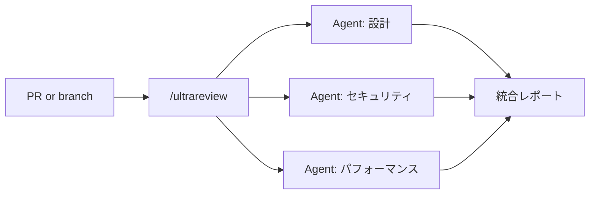

# Catch Up: Claude Code Releases

Claude Code の未要約リリースをまとめて検出・要約・保存するスキル。
Claude Code セッション内で手動実行する想定（1日の最初に1回叩けば十分）。

## ワークフロー

### 1. 既存ファイル一覧の取得

Obsidian Vault に既に存在する要約ファイル名を取得：

```bash
ls "$HOME/Documents/Obsidian Vault/ClaudeCodeUpdates/" 2>/dev/null | grep -E '^v[0-9]' | sed 's/\.md$//'
```

ディレクトリが存在しない場合は作成：

```bash
mkdir -p "$HOME/Documents/Obsidian Vault/ClaudeCodeUpdates"
```

### 2. GitHub Releases から最新タグ一覧を取得

直近20件のリリースタグを取得：

```bash
gh api 'repos/anthropics/claude-code/releases?per_page=20' --jq '.[].tag_name'
```

### 3. 差分の計算

ステップ2のタグのうち、ステップ1のファイル名に存在しないものを「未要約バージョン」とする。

未要約バージョンが0件なら、次のように1行で報告して終了：

```
✅ 現時点で未要約のリリースはありません（最新: vX.Y.Z）
```

### 4. 未要約バージョンの要約・保存

未要約バージョンを **古い順** に処理する。
各バージョンについて：

a. リリースノートを取得：

```bash
gh api repos/anthropics/claude-code/releases --jq '.[] | select(.tag_name == "<TAG>") | .body'
```

リリースノートが空の場合は、そのバージョンはスキップして次へ進む（最終レポートでスキップした旨を記載）。

b. **下記の「出力フォーマット」と「ルール」に厳密に従って** 日本語で要約。

c. 結果を以下のパスに保存（パスにスペースがあるので必ずクォート）：

```
~/Documents/Obsidian Vault/ClaudeCodeUpdates/<TAG>.md
```

### 5. 最終レポート

すべて処理し終わったら、1ブロックで簡潔に報告する。
例：

```
✅ 3件のリリースを要約しました
- v2.1.144 → ~/Documents/Obsidian Vault/ClaudeCodeUpdates/v2.1.144.md
- v2.1.145 → ~/Documents/Obsidian Vault/ClaudeCodeUpdates/v2.1.145.md
- v2.1.146 → ~/Documents/Obsidian Vault/ClaudeCodeUpdates/v2.1.146.md

⏭️ スキップ: なし
```

---

## 出力フォーマット（厳守）

各バージョンの要約ファイルは以下のフォーマットで生成する。

````markdown
# Claude Code v{VERSION} アップデートまとめ

## 💡 注目ポイント

（1〜5 個、各 3〜5 行で深掘り。発火条件に該当する場合は Mermaid 図解を入れる）

## 📋 変更一覧

### 🚨 セキュリティ修正
| 変更 | 誰にどう嬉しいか |
|---|---|
| ... | ... |

### ✨ 新機能
| 変更 | 誰にどう嬉しいか |
|---|---|

### ⬆️ 改善
| 変更 | 誰にどう嬉しいか |
|---|---|

### 🐛 バグ修正
| 変更 | 誰にどう嬉しいか |
|---|---|

### 📝 その他
| 変更 | 誰にどう嬉しいか |
|---|---|
````

該当のないカテゴリのテーブルは丸ごと省略する。

## ルール

### ① 注目ポイントは「冒頭に」「1〜5 個可変で」書く

リリースのインパクトに応じて個数を変える。
**「必ず3個」のように固定しない**。

| リリース規模 | 注目ポイント数の目安 |
|---|---|
| 小規模（バグ修正中心） | 1〜2 個 |
| 通常リリース | 2〜3 個 |
| 大型リリース（新機能複数） | 4〜5 個 |
| 完全に内部実装のみ | 0 個（注目ポイントセクション自体を省略） |

### ② 注目ポイントの中身（各 3〜5 行）

各注目ポイントは以下の4要素を含める：

| 要素 | 説明 |
|---|---|
| 何が変わったか | 機能・変更の概要（1 行） |
| これまでの課題 | なぜこの変更が必要だったか、今まで何が不便だったか |
| ユーザーへの嬉しさ | 日々の作業でどう変わるか、どんなシーンで効くか |
| 注意点・ヒント | 破壊的変更、オプトイン方法、既存挙動との違い（あれば） |

### ③ Mermaid 図解の発火条件

注目ポイントが以下のトリガーに**該当したら必ず Mermaid 図を入れる**。
該当しなければ入れない。
判断のグレーゾーンを作らない。

| トリガー（該当 → 図を入れる） | 図の種類 | 例 |
|---|---|---|
| 挙動の Before/After 変化（既存挙動が変わった） | `flowchart LR`（2カラム） | `disable` が依存検出するようになった、`Ctrl+U` の挙動変更 |
| 新しいコマンド・ツール・ワークフロー追加 | `flowchart TD` / `flowchart LR` | `/ultrareview` の処理フロー |
| 状態遷移・ループ制御・上限管理 | `sequenceDiagram` | Stop hook の連続ブロック→8回で打ち切り |
| 時系列・段階的処理・継続イベント | `sequenceDiagram` / `timeline` | モデル切り替えの流れ |
| バージョン間の関係・履歴 | `timeline` | リリース履歴 |

**図を入れない除外条件**（これらに該当する時だけ図なしで OK）：
- 純粋な内部実装変更（リファクタリング、性能改善のみで挙動変化なし）
- 設定値・環境変数の単純な追加だけ
- 1行で説明できる単発のバグ修正

**「本文で伝わるから入れない」という判断はしない**。
トリガーに該当する変更があれば必ず図を入れる。

### ④ 変更一覧テーブルの書き方

| 列 | 内容 | NG例 | OK例 |
|---|---|---|---|
| 変更 | 短い技術的事実。CLI フラグ・コマンド名・環境変数はそのまま | "新機能を追加" | "`/ultrareview` コマンドを追加" |
| 誰にどう嬉しいか | エンジニアでない人にも伝わる説明 | "並列マルチエージェントレビュー" | "PR レビューを複数 AI で並列実行でき、見落としが減る" |

### ⑤ 分類のキーワード対応表

| リリースノートのキーワード | 分類先 |
|---|---|
| vulnerability, bypass, injection, arbitrary code execution | 🚨 セキュリティ修正 |
| Added で始まる新機能・新コマンド | ✨ 新機能 |
| Improved、または Added でも既存機能の拡張 | ⬆️ 改善 |
| Fixed | 🐛 バグ修正 |
| 上記に当てはまらない変更 | 📝 その他 |

## 出力例（v2.1.111 を題材に）

````markdown
# Claude Code v2.1.111 アップデートまとめ

## 💡 注目ポイント

### 1. `/ultrareview` コマンド追加 — PR レビューの質と速度を一段引き上げる

従来のコードレビューは単一のモデルが上から順に読む形式で、大きな PR だと
見落としが出やすく時間もかかっていた。この機能はクラウド上で複数の
エージェントを並列に走らせて観点別にチェックするため、設計ミス・セキュリティ
懸念・パフォーマンス問題などを同時に洗い出せる。引数なしで現在のブランチ、
`/ultrareview <PR#>` で任意の GitHub PR をレビュー可能。



人間レビュアーの前段フィルターとして使うと、指摘の粒度が粗い初期ラウンドを
AI に任せられる。

### 2. Auto モードが Opus 4.7 で利用可能に（Max プラン）

これまではタスクに応じて手動でモデルを切り替える必要があり、
「重い実装は Opus、軽い質問は Sonnet」のような使い分けを毎回判断していた。
Auto モードはタスクの難易度を見て自動でモデルを選んでくれるため、
普段使いで迷わず速さと賢さのバランスが取れる。

## 📋 変更一覧

### ✨ 新機能
| 変更 | 誰にどう嬉しいか |
|---|---|
| `/ultrareview` コマンド | PR レビューを複数 AI で並列実行、見落としを削減 |
| Auto モードが Opus 4.7 対応（Max プラン） | モデル選択の手間がなくなる |

### ⬆️ 改善
| 変更 | 誰にどう嬉しいか |
|---|---|
| `Ctrl+U` で入力バッファ全体をクリア（以前は行頭まで） | 長い入力を1発で消せる。誤爆時は `Ctrl+Y` で復元 |

### 🐛 バグ修正
| 変更 | 誰にどう嬉しいか |
|---|---|
| iTerm2 + tmux で長時間実行時の画面崩れ修正 | 文字化けで作業不能になる問題が解消 |
````

このフォーマット・粒度を厳守する。

## 補足

「特定バージョンだけ再生成したい」場合は、Vault からそのファイル（例: `~/Documents/Obsidian Vault/ClaudeCodeUpdates/v2.1.144.md`）を削除して、このスキルを再実行すれば差分検出で拾われる。
