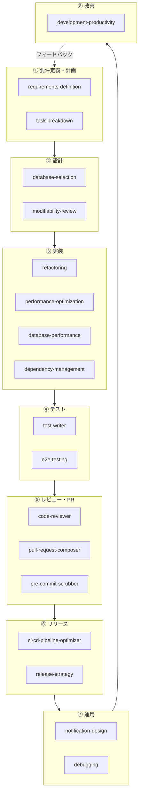
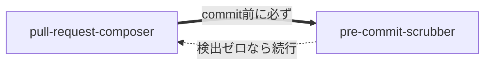
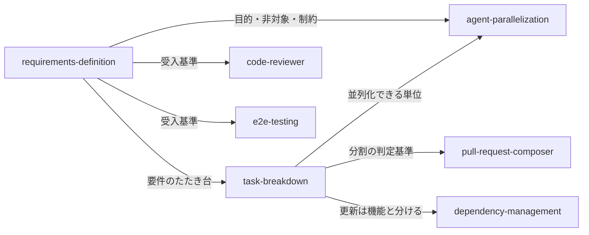
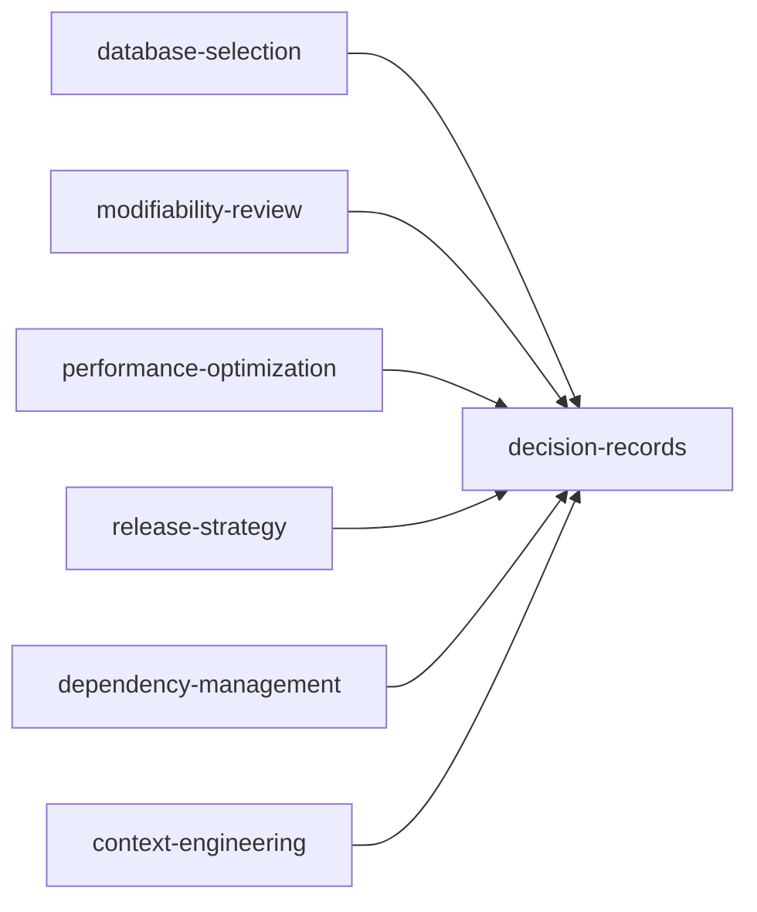

# skills

Claude Code の再利用可能なスキル（`.claude/skills/`）を集めたリポジトリ。各スキルは `<name>/SKILL.md` を本体とし、必要に応じて `references/`（詳細資料）・`assets/`（雛形）・`scripts/`（実行コード）を持つ。

スキルはユーザーが明示的に呼び出すものではなく、`SKILL.md` の `description` に書かれたトリガー文言や場面に一致したときにエージェントが自律的に読み込む（progressive disclosure）。スキルの書き方・命名・相互参照の規約は [`CLAUDE.md`](./CLAUDE.md) を参照。

## サイクルで見る

要件定義から改善までの開発サイクルに沿って分類すると、以下のようになる。フェーズをまたいで使うスキル（エージェント運用・意思決定の記録）は下段に分けている。



フェーズをまたいで、サイクル全体を下支えするスキル。

```mermaid
flowchart LR
    Cycle["要件定義〜改善の全サイクル"]
    DR[decision-records]
    AP[agent-parallelization]
    SD[subagent-delegation]
    AS[agent-security]
    CE[context-engineering]

    DR -. 後戻りしにくい決定を記録 .-> Cycle
    AP -. 複数エージェントの同時実行 .-> Cycle
    SD -. サブタスクの切り出し .-> Cycle
    AS -. 外部テキスト・権限の安全性 .-> Cycle
    CE -. CLAUDE.md/メモリの設計 .-> Cycle
```

### ① 要件定義・計画

| スキル | 概要 |
|---|---|
| `requirements-definition` | 曖昧な機能要望から、目的・受入基準・非対象・制約を実装着手前に固める |
| `task-breakdown` | 実装を、安全にマージ・revertできる小さな単位に分解する |

### ② 設計

| スキル | 概要 |
|---|---|
| `database-selection` | RDB・ドキュメント・KVS・DWHなど、用途に応じたデータストアを選ぶ |
| `modifiability-review` | 変更が「分ける／なおす／壊す」のどれかを分類し、変更容易性を点検する |

### ③ 実装

| スキル | 概要 |
|---|---|
| `refactoring` | 振る舞いを変えずに構造だけを整理し、構造変更と振る舞い変更を分離する |
| `performance-optimization` | 「遅い・重い」相談を、症状分類と優先順位づけで解決する |
| `database-performance` | ストレージ読み取り量の最小化を軸に、DBの遅さを解消する |
| `dependency-management` | 依存の追加は必要性の吟味から、更新はチェンジログ確認と一つずつの原則で進める |

### ④ テスト

| スキル | 概要 |
|---|---|
| `test-writer` | カバレッジ数値でなく「壊れたら確実に落ちる」防御的なテストを設計する |
| `e2e-testing` | 主要な動線に絞った、信頼できる小規模なE2Eスイートを維持する |

### ⑤ レビュー・PR

| スキル | 概要 |
|---|---|
| `code-reviewer` | 作成者以外の視点で、機械に任せられない判断（設計適合・要件充足など）に絞ってレビューする |
| `pull-request-composer` | 差分を粒度で診断し、分割案の提示・コミット・PR作成までを仕立てる |
| `pre-commit-scrubber` | `commit` 前にシークレット・PII・組織固有名の混入をスキャンする |

### ⑥ リリース

| スキル | 概要 |
|---|---|
| `ci-cd-pipeline-optimizer` | CIの高速化・リリース自動化・結果通知の3軸でパイプラインを改善する |
| `release-strategy` | デプロイとリリースを分離し、Feature Flagで段階的に機能を公開する |

### ⑦ 運用

| スキル | 概要 |
|---|---|
| `notification-design` | 問題に気づくまでの時間（MTTD）を縮める通知・監視を設計する |
| `debugging` | 仮説を立ててから1つずつ検証する、原因調査と本番障害対応の手順 |

### ⑧ 改善

| スキル | 概要 |
|---|---|
| `development-productivity` | 開発生産性を3段階で定義し、グッドハートの法則を警戒しながら計測・改善する |

### 横断（意思決定の記録）

| スキル | 概要 |
|---|---|
| `decision-records` | 後戻りしにくい決定を、軽量なADR形式で後から参照できる形に残す |

## AI駆動開発の運用基盤

コードの中身ではなく、「AIエージェントにどう作業させるか」という運用そのものを扱うスキル。上記どのフェーズでも使う。

| スキル | 概要 |
|---|---|
| `agent-parallelization` | 複数のAIエージェントを、作業ツリーを分離しながら同時実行する |
| `subagent-delegation` | 1つの有界なサブタスクを、メインの会話の文脈を汚さずに切り出す |
| `agent-security` | 外部テキストを指示として扱わず、ツール権限を許可リストで絞る |
| `context-engineering` | `CLAUDE.md`・永続メモリなど、エージェントに読ませる情報の置き場所を設計する |

## その他（リポジトリ運用ツール）

開発サイクルそのものではなく、このリポジトリ／個人の作業環境を運用するためのツール。

| スキル | 概要 |
|---|---|
| `catch-up-claude-code` | Claude Codeの未読リリースを検出・要約してVaultに保存する |
| `catch-up-vscode` | VS Codeの未読リリースを検出・要約してVaultに保存する |
| `reflect-on-sessions` | 過去のAIコーディングセッションを横断レビューし、繰り返すパターンを永続メモリへ反映する |
| `intro-video` | 手元の資料（README・設計ドキュメント等）からナレーション付きの紹介動画を生成する |

## スキル同士のつながり

各 `SKILL.md` には他スキルへの参照が計60本あるが、その大半は「詳細は◯◯を見よ」という案内や「ここは対象外」という境界宣言で、実行や成果物の受け渡しを伴わない。**前のスキルの成果がそのまま次のスキルの入力になる**関係だけを抜き出すと、次の3つに集約される。

### 1. commit前に必ず通すゲート



リポジトリ全体で、片方の実行が必須になっている依存はこの1組だけ。他は全て「必要なら読む」関係。

### 2. 要件定義・タスク分解が起点になる



矢印のラベルは、下流のスキルが「すでにある」前提で書いている成果物そのもの。`code-reviewer` は受入基準を、`agent-parallelization` は3ステップ判定を通過したタスクを前提にしている。

**順番の強制ではない。** どのスキルも単体で使える。上流を飛ばすと、下流はその前提を欠いたまま動くだけ（`code-reviewer` なら要件充足の判定だけ諦めて `[ask]` で返す）。

### 3. 決定は decision-records に集まる



後戻りしにくい決定を出すスキルは、いずれも結果を `decision-records` へ渡す。逆に `decision-records` から他スキルへ流れるものは無く、受け皿に徹している。

### その他の受け渡し

条件が成立したときだけ発生する引き継ぎ。成立しなければ、その後続の作業が起きないだけ。

| 条件 | 引き継ぎ | 渡すもの |
|---|---|---|
| 待ちの原因がDBだと特定できた | `performance-optimization` → `database-performance` | 以降の改善作業そのもの |
| 本番で長時間気づかれなかった | `debugging` → `notification-design` | 検知が遅れた事実（通知の仕組みを見直す） |
| 原因が判明した | `debugging` → `test-writer` | 調査で使った再現手順（そのままテストにする） |

上のどれにも出てこないスキル（`refactoring`・`ci-cd-pipeline-optimizer`・`subagent-delegation`・`agent-security` など）は、他スキルとの間に成果物の受け渡しが無く、単体で完結して使える。

## スキルの書き方

新しいスキルの追加・既存スキルの改修は [`CLAUDE.md`](./CLAUDE.md) の規約に従う。要点だけ挙げると：

- 新規スキルは既存スキルへの参照を最低1本、多くても2〜3本に留める（孤島にしない、増やしすぎない）
- 同じ判断基準を複数のスキルに複製しない。正典を1つ決め、他方は参照に縮める
- 統合すべきか分けるべきかは、承認ゲートの性質・前提とする実行環境が違うかで判断する
